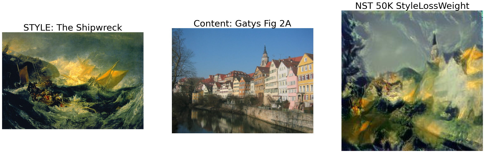
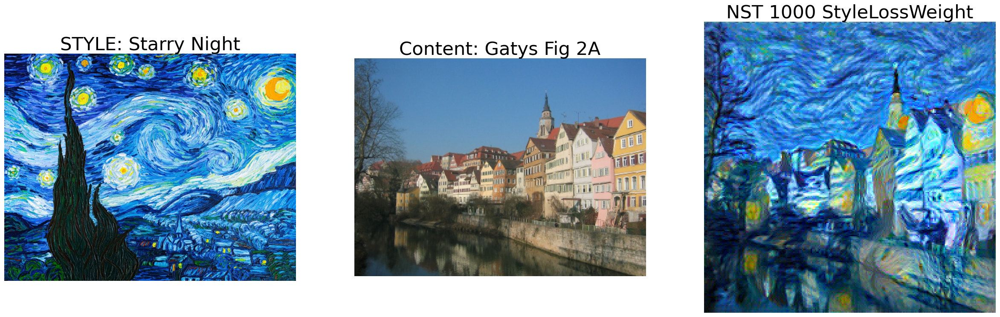
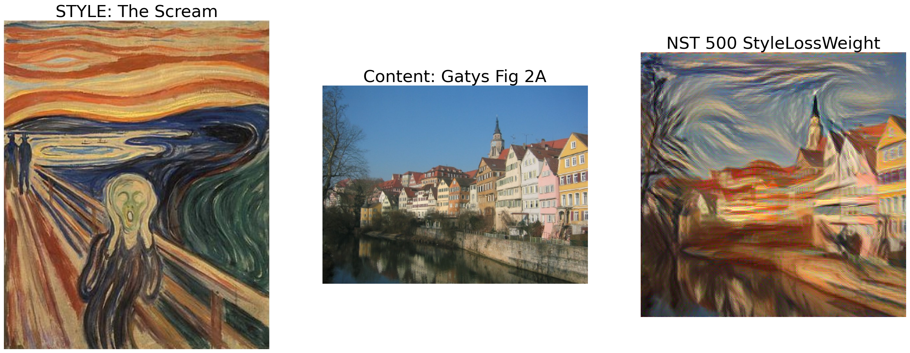
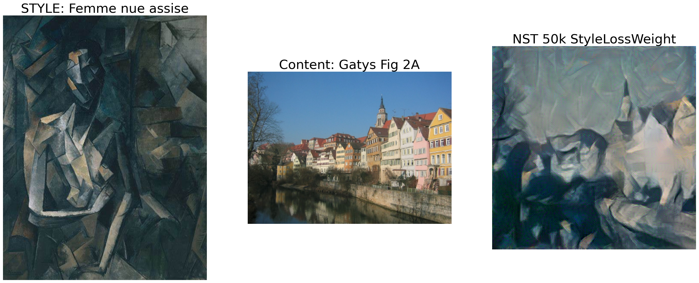
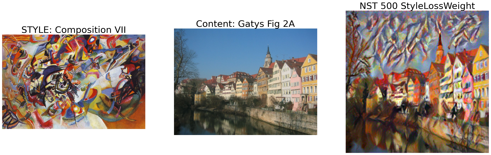
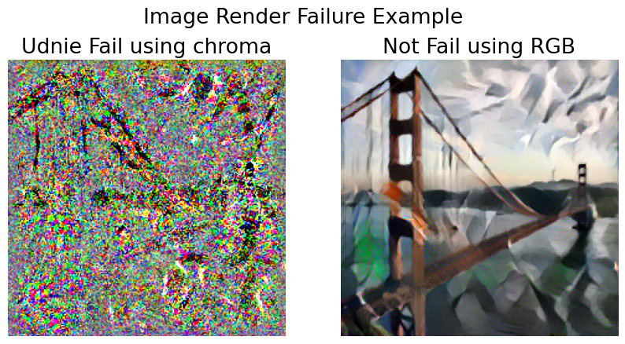

```python
import matplotlib.pyplot as plt
import numpy as np
import cv2
```


```python
STYLE_IMAGE_DIR = "images/style/"
CONTENT_IMAGE_DIR = "images/content/"
OUT_DIR = "images/output/"
```

### IMAGES RENDERED using coloraware on Gatys' Fig 2 image and styles

#### Neural Style Transfer paper: https://arxiv.org/abs/1508.06576


```python
STYLE_NAME1= STYLE_IMAGE_DIR + "theShipwreck.jpg"
CONTENT_NAME1 = CONTENT_IMAGE_DIR + "Gatys_NST_Paper_ImageA.jpg"
bestShip = OUT_DIR + "bestGatys/best_Shipwreck_50k-pt35.jpg"

style_img1 = cv2.imread(STYLE_NAME1)
content_img1 = cv2.imread(CONTENT_NAME1)
bestShip_img1 = cv2.imread(bestShip)

plt.figure(figsize=(30, 10))
plt.rcParams['font.size'] = 26
plt.subplot(1,3,1)
plt.axis('off')
plt.imshow(style_img1[:,:,[2,1,0]])
plt.title('STYLE: The Shipwreck')
plt.subplot(1,3,2)
plt.axis('off')
plt.imshow(content_img1[:,:,[2,1,0]])
plt.title('Content: Gatys Fig 2A')
plt.subplot(1,3,3)
plt.axis('off')
plt.imshow(bestShip_img1[:,:,[2,1,0]])
plt.title('NST 50K StyleLossWeight')

```


    Text(0.5, 1.0, 'NST 50K StyleLossWeight')


    

    


```python
STYLE_NAME2= STYLE_IMAGE_DIR + "starryNight.jpg"
CONTENT_NAME2 = CONTENT_IMAGE_DIR + "Gatys_NST_Paper_ImageA.jpg"
bestStarry = OUT_DIR + "bestGatys/best_Starry_1kLoss-pt35.png"

style_img2 = cv2.imread(STYLE_NAME2)
content_img2 = cv2.imread(CONTENT_NAME2)
bestStarry_img = cv2.imread(bestStarry)

plt.figure(figsize=(30, 20))
plt.rcParams['font.size'] = 26  #increase font of outputs
plt.subplot(1,3,1)
plt.axis('off')
plt.imshow(style_img2[:,:,[2,1,0]])
plt.title('STYLE: Starry Night')
plt.subplot(1,3,2)
plt.axis('off')
plt.imshow(content_img2[:,:,[2,1,0]])
plt.title('Content: Gatys Fig 2A')
plt.subplot(1,3,3)
plt.axis('off')
plt.imshow(bestStarry_img[:,:,[2,1,0]])
plt.title('NST 1000 StyleLossWeight')

```


    Text(0.5, 1.0, 'NST 1000 StyleLossWeight')


    

    


```python
STYLE_NAME3= STYLE_IMAGE_DIR + "theScream.jpg"
CONTENT_NAME3 = CONTENT_IMAGE_DIR + "Gatys_NST_Paper_ImageA.jpg"
bestScream = OUT_DIR + "bestGatys/best_Scream_500-pt35.png"

style_img3 = cv2.imread(STYLE_NAME3)
content_img3 = cv2.imread(CONTENT_NAME3)
bestScream_img = cv2.imread(bestScream)

plt.figure(figsize=(30, 20))
plt.rcParams['font.size'] = 26
plt.subplot(1,3,1)
plt.axis('off')
plt.imshow(style_img3[:,:,[2,1,0]])
plt.title('STYLE: The Scream')
plt.subplot(1,3,2)
plt.axis('off')
plt.imshow(content_img3[:,:,[2,1,0]])
plt.title('Content: Gatys Fig 2A')
plt.subplot(1,3,3)
plt.axis('off')
plt.imshow(bestScream_img[:,:,[2,1,0]])
plt.title('NST 500 StyleLossWeight')

```


    Text(0.5, 1.0, 'NST 500 StyleLossWeight')


    

    


```python
STYLE_NAME4= STYLE_IMAGE_DIR + "femmeNueAssise.jpg"
CONTENT_NAME4 = CONTENT_IMAGE_DIR + "Gatys_NST_Paper_ImageA.jpg"
bestFemme = OUT_DIR + "bestGatys/best_Femme_50k-pt30.png"

style_img4 = cv2.imread(STYLE_NAME4)
content_img4 = cv2.imread(CONTENT_NAME4)
bestFemme_img = cv2.imread(bestFemme)

plt.figure(figsize=(30, 20))
plt.rcParams['font.size'] = 26
plt.subplot(1,3,1)
plt.axis('off')
plt.imshow(style_img4[:,:,[2,1,0]])
plt.title('STYLE: Femme nue assise')
plt.subplot(1,3,2)
plt.axis('off')
plt.imshow(content_img4[:,:,[2,1,0]])
plt.title('Content: Gatys Fig 2A')
plt.subplot(1,3,3)
plt.axis('off')
plt.imshow(bestFemme_img[:,:,[2,1,0]])
plt.title('NST 50k StyleLossWeight')

```


    Text(0.5, 1.0, 'NST 50k StyleLossWeight')


    

    


```python
STYLE_NAME5= STYLE_IMAGE_DIR + "composition_VII.jpg"
CONTENT_NAME5 = CONTENT_IMAGE_DIR + "Gatys_NST_Paper_ImageA.jpg"
bestComp7 = OUT_DIR + "bestGatys/best_Comp7_500-pt35.png"

style_img5 = cv2.imread(STYLE_NAME5)
content_img5 = cv2.imread(CONTENT_NAME5)
bestComp7_img = cv2.imread(bestComp7)

plt.figure(figsize=(30, 20))
plt.rcParams['font.size'] = 26
plt.subplot(1,3,1)
plt.axis('off')
plt.imshow(style_img5[:,:,[2,1,0]])
plt.title('STYLE: Composition VII')
plt.subplot(1,3,2)
plt.axis('off')
plt.imshow(content_img5[:,:,[2,1,0]])
plt.title('Content: Gatys Fig 2A')
plt.subplot(1,3,3)
plt.axis('off')
plt.imshow(bestComp7_img[:,:,[2,1,0]])
plt.title('NST 500 StyleLossWeight')

```


    Text(0.5, 1.0, 'NST 500 StyleLossWeight')


    

    


#### Directory Lists for Styles Rendered for Gatys Paper Comparision and Showing Loss Progression


```python
OUT_DIR_SHIPWRECK = OUT_DIR + "gatysShipwreck/"
OUT_DIR_STARRY = OUT_DIR + "gatysStarry/"
OUT_DIR_SCREAM = OUT_DIR + "gatysScream/"
OUT_DIR_FEMME = OUT_DIR + "gatysFemme/"
OUT_DIR_COMP7 = OUT_DIR + "gatysComp7/"
directoryList = [OUT_DIR_SHIPWRECK,OUT_DIR_STARRY,OUT_DIR_SCREAM,OUT_DIR_FEMME,OUT_DIR_COMP7]
```

#### Set of images from StyleLossWeight = 100,1000,10000,100000 similar range to Gatys' Paper Figure 3 (but on final image)


```python
#More images are available but this corresponds to the range shown in Gatys Paper Figure 3 for Composition 7 
                                                                  #except that's at channel level this is final output
#SHIPWRECK SET
images_shipwreck = ["gatysShipwreck_1hLoss_chroma_L2-sigma-pt35.jpg","gatysShipwreck_1kLoss_chroma_L2-sigma-pt35.jpg",
                    "gatysShipwreck_10kLoss_chroma_L2-sigma-pt35.jpg","gatysShipwreck_100kLoss_chroma_L2-sigma-pt35.jpg"]

#STARRY NIGHT SET
images_starry =["gatysStarry_1hLoss_chroma_L2-sigma-pt30.png","gatysStarry_1kLoss_chroma_L2-sigma-pt30.png",
                "gatysStarry_10kLoss_chroma_L2-sigma-pt30.png","gatysStarry_100kLoss_chroma_L2-sigma-pt30.png"]

#SCREAM SET
images_scream =["gatysScream_1hLoss_chroma_L2-sigma-pt35.png","gatysScream_1kLoss_chroma_L2-sigma-pt35.png",
                "gatysScream_10kLoss_chroma_L2-sigma-pt35.png","gatysScream_100kLoss_chroma_L2-sigma-pt35.png"]

#FEMME SET
images_femme =["gatysFemme_1hLoss_L2-sigma-pt25.png","gatysFemme_1kLoss_L2-sigma-pt25.png",
               "gatysFemme_10kLoss_chroma_L2-sigma-pt30.png","gatysFemme_100kLoss_chroma_L2-sigma-pt30.png"]

#COMPOSTION_VII SET
images_comp7 = ["gatysComp7_1hLoss_chroma_L2-sigma-pt35.png","gatysComp7_1kLoss_chroma_L2-sigma-pt35.jpg",
                "gatysComp7_10kLoss_chroma_L2-sigma-pt35.jpg","gatysComp7_100kLoss_chroma_L2-sigma-pt35.jpg"]

nFiles = 4
styleLoss= [1e-2,1e-3,1e-4,1e-5]   # content / style is stlye loss factor
images = [images_shipwreck,images_starry,images_scream,images_femme,images_comp7]
```

#### Displaying Images similar to Gatys Figure 3: Content Loss with Increased Style Weight


```python
nSet = len(images)
nImg = nFiles
nSet = len(images)
plt.figure(figsize=(30, 30))
plt.suptitle('Style Loss Weights 100,1000,10000,100000')
for i in range(nSet):
    for j in range(nFiles):
        fn = directoryList[i] + images[i][j]
        img = cv2.imread(fn)
        idx = i*nFiles+j+1
        plt.subplot(nSet,nImg,idx)
        plt.axis('off')
        plt.imshow(img[:,:,[2,1,0]])

```


    

    


#### Preparing Rendered Images for 9 Styles of the Golden Gate Bridge


```python
#PREPARING ORDER LIST FOR DISPLAY OF GoldenGate Bridge rendered with styles / content after selection for good results <BEST IMAGES>

listOfStyles = ["Picture","The Shipwreck", "Starry Night", "The Scream", "Femme nue assise","Composition VII",
                "Candy","Mosaic","Rain Princess","Udnie"]

imDIR = OUT_DIR + "bestGoldenGate/"
imagesGoldenGate = ["golden_gate.jpg","ggShipwreck_5kLoss_chroma_L2-sigma-pt35.jpg","ggStarry_2kLoss_chroma_L2-sigma-pt30.jpg",
                    "ggScream_1kLoss_chroma_L2-sigma-pt20.png","ggFemme_10kLoss_chroma_L2-sigma-pt30.jpg",
                    "gg7_100kLoss_chroma_L2-sigma-pt40.png","ggCandy_1kLoss_chroma_L2-sigma-pt20.png",
                    "ggMo_1kLoss_chroma_L2-sigma-pt30.png","ggRP_100kLoss_chroma_L2.png",
                    "ggUdnie_1kLoss_chroma_L2-pt40.png"]

sDIR = STYLE_IMAGE_DIR
styleImages = ["noStyle.png","theShipwreck.jpg","starryNight.jpg","theScream.jpg","femmeNueAssise.jpg","composition_VII.jpg",
               "candy.jpg","mosaic.jpg","rain-princess.jpg","udnie.jpg"]
```


```python
#Displaying Images
nImg2 = len(listOfStyles)
totalImg = 2*nImg

plt.figure(figsize=(40, 40))
#plt.suptitle(None)
plt.rcParams['font.size'] = 26
idx = 0
for i in range(nImg2):
    idx= 2*i+1
    fnStyle = sDIR + styleImages[i]
    fnImg = imDIR + imagesGoldenGate[i]
    imgS = cv2.imread(fnStyle) 
    imgGG = cv2.imread(fnImg)
    plt.subplot(nImg2//2,4,idx)
    plt.axis('off')
    plt.title(listOfStyles[i])
    plt.imshow(imgS[:,:,[2,1,0]])
    idx +=1
    plt.subplot(nImg2//2,4,idx)
    plt.axis('off')
    plt.imshow(imgGG[:,:,[2,1,0]])
```


    

    


#### Failure of Color Method


```python
nFail = OUT_DIR + "gg_udnie_runs/ggUt_1kLoss_chroma_L2-pt40.png"
nNonFail = OUT_DIR + "gg_udnie_runs/ggUt_1kLoss_L2-pt40.png"
failImg = cv2.imread(nFail)
nonFailImg = cv2.imread(nNonFail)
plt.rcParams['font.size'] = 16
plt.figure(figsize=(10, 5))
plt.suptitle('Image Render Failure Example')

plt.subplot(1,2,1)
plt.axis('off')
plt.imshow(failImg[:,:,[2,1,0]])
plt.title('Udnie Fail using chroma')
plt.subplot(1,2,2)
plt.axis('off')
plt.imshow(nonFailImg[:,:,[2,1,0]])
plt.title('Not Fail using RGB')


```


    Text(0.5, 1.0, 'Not Fail using RGB')


    

    


```python

```
